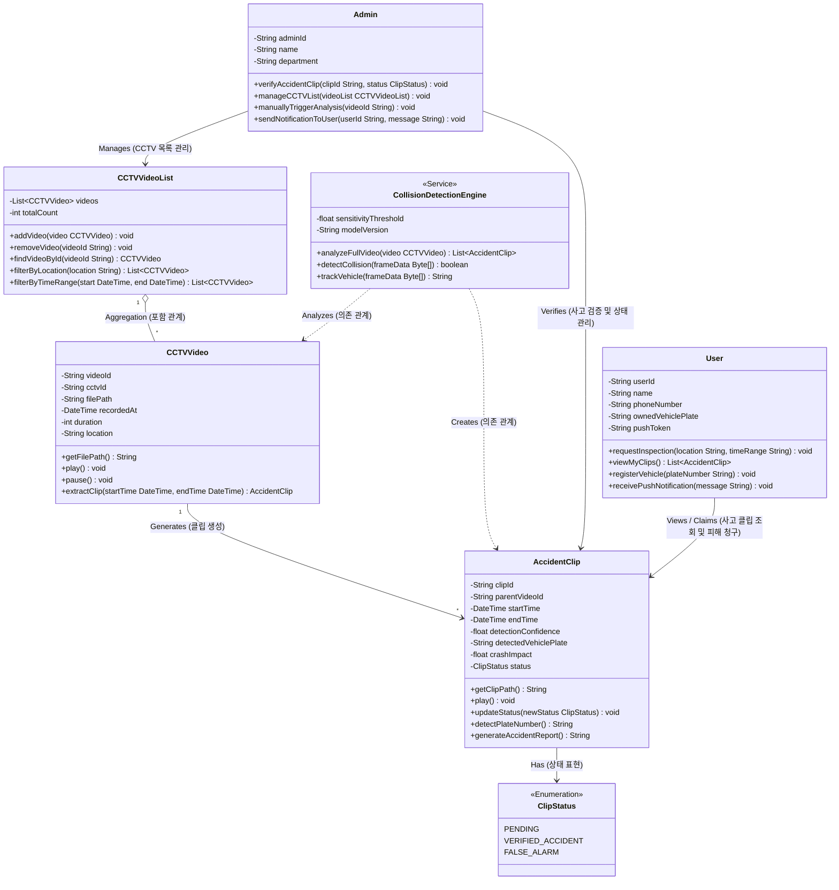

# 🚗 물피도주 관리 시스템 Class Diagram

본 문서에는 **물피도주(차량 충돌 후 도주) 감지 및 관리 시스템**의 객체지향 설계를 위한 클래스 다이어그램과 각 클래스의 상세 설명이 포함되어 있습니다. `Class Diagram 지침서.md`에 명시된 필수 클래스들을 기반으로, 시스템의 완성도를 높이기 위해 필요한 속성(Attributes), 메서드(Methods), 그리고 관계(Relationships)를 구체적으로 정의하였습니다.

---

## 📊 1. Mermaid 클래스 다이어그램

아래 다이어그램은 물피도주 감지 시스템의 핵심 클래스 구조와 상호작용을 나타냅니다.

---

## 📝 2. 클래스 상세 설명 및 명세

### 1) `CCTVVideo` (CCTV 영상 - 전체)
CCTV 카메라를 통해 촬영된 전체 고화질 영상 데이터를 관리하는 클래스입니다.
*   **주요 속성:**
    *   `videoId`: 영상의 고유 식별자.
    *   `cctvId`: 영상을 촬영한 CCTV 기기의 고유 번호.
    *   `filePath`: 서버 또는 로컬 스토리지에 저장된 원본 영상 경로.
    *   `recordedAt`: 영상 촬영이 시작된 일시.
    *   `duration`: 영상의 전체 길이(단위: 초).
    *   `location`: CCTV가 설치된 위치 정보.
*   **주요 메서드:**
    *   `play() / pause()`: 영상을 재생하거나 일시정지하는 비디오 컨트롤러 기능.
    *   `extractClip(startTime, endTime)`: 전체 영상 중 사고가 의심되는 특정 타임스탬프 구간을 추출하여 `AccidentClip` 객체로 반환.

### 2) `CCTVVideoList` (CCTV 영상 목록)
시스템에 등록된 모든 전체 CCTV 영상들의 컬렉션을 관리하는 클래스입니다.
*   **주요 속성:**
    *   `videos`: 등록된 `CCTVVideo` 객체들의 리스트.
    *   `totalCount`: 현재 관리 중인 전체 영상의 개수.
*   **주요 메서드:**
    *   `addVideo(video) / removeVideo(videoId)`: 영상 등록 및 삭제.
    *   `findVideoById(videoId)`: 특정 영상을 ID로 단일 조회.
    *   `filterByLocation(location)`: 특정 구역/위치의 CCTV 영상들만 필터링하여 조회.
    *   `filterByTimeRange(start, end)`: 특정 시간대에 촬영된 영상들만 필터링하여 조회.

### 3) `AccidentClip` (사고 의심 클립)
전체 CCTV 영상 중에서 충돌 및 물피도주 의심 이벤트가 감지된 10~30초 안팎의 짧은 사고 지점 클립입니다.
*   **주요 속성:**
    *   `clipId`: 사고 클립의 고유 식별자.
    *   `parentVideoId`: 사고 클립이 추출된 원본 `CCTVVideo` ID.
    *   `startTime / endTime`: 사고 발생 전후의 짧은 재생 구간 정보.
    *   `detectionConfidence`: AI 모델이 판단한 물피도주 충돌 신뢰도 (예: 95%).
    *   `detectedVehiclePlate`: 번호판 인식 모듈을 통해 검출된 가해 차량의 차량 번호.
    *   `crashImpact`: 가속도 또는 오디오 분석 기반 충돌 세기 파라미터.
    *   `status`: 관리자 검증 상태 (`ClipStatus` Enum 참조).
*   **주요 메서드:**
    *   `play()`: 사고 장면 클립 재생.
    *   `updateStatus(newStatus)`: 관리자 검증을 마친 후 대기(PENDING)에서 검증 완료(VERIFIED) 또는 오탐(FALSE_ALARM)으로 상태 업데이트.
    *   `detectPlateNumber()`: 클립 내 가해 차량의 프레임을 추적하여 차량 번호판을 판독.
    *   `generateAccidentReport()`: 사고 관련 원본 파일, 시간, 인식된 가해 차량 번호판을 포함한 보고서 텍스트 생성.

### 4) `User` (일반 사용자)
물피도주 피해를 본 차량 차주 또는 일반 이용자입니다.
*   **주요 속성:**
    *   `userId`: 사용자의 고유 아이디.
    *   `name`: 사용자 이름.
    *   `phoneNumber`: 비상 연락처.
    *   `ownedVehiclePlate`: 사용자가 등록한 본인 소유의 차량 번호판 (피해 차량 감지에 활용).
    *   `pushToken`: 알림 발송용 기기 토큰.
*   **주요 메서드:**
    *   `requestInspection(location, timeRange)`: 피해 발생 예상 구역과 시간대를 지정하여 관리자에게 영상 분석 및 열람을 공식 요청.
    *   `viewMyClips()`: 사용자의 차량 번호와 매칭되거나 열람 허가가 완료된 사고 의심 클립 리스트를 확인.
    *   `registerVehicle(plateNumber)`: 자신의 차량 정보를 시스템에 등록.
    *   `receivePushNotification(message)`: 물피도주 의심 사례 발견 시 푸시 알림을 수신.

### 5) `Admin` (관리자)
관제 센터 직원 또는 물피도주 감지 시스템을 모니터링하고 최종 확인을 수행하는 운영자입니다.
*   **주요 속성:**
    *   `adminId`: 관리자 계정 아이디.
    *   `name`: 관리자 이름.
    *   `department`: 관리자 소속 부서.
*   **주요 메서드:**
    *   `verifyAccidentClip(clipId, status)`: AI 엔진에 의해 분류된 사고 클립을 직접 눈으로 보고, 실제 물피도주 사고가 맞는지 판정하여 상태(`ClipStatus`)를 업데이트.
    *   `manageCCTVList(videoList)`: 새로운 CCTV 카메라를 등록하거나 이전 영상을 아카이브하는 관리 권한.
    *   `manuallyTriggerAnalysis(videoId)`: 특정 원본 CCTV 비디오를 지정하여 AI 분석 엔진을 수동으로 재가동.
    *   `sendNotificationToUser(userId, message)`: 매칭된 가해/피해 차주에게 안내 메시지 및 증거 클립 전송 지시.

### 6) `CollisionDetectionEngine` (AI 충돌 감지 엔진 - 추가됨)
CCTV 영상 파일에서 실제 충돌과 차량 도주 여부를 자동 식별하는 딥러닝 기반 핵심 분석 엔진입니다.
*   **주요 속성:**
    *   `sensitivityThreshold`: 감도 임계값 (설정에 따른 오탐률 조정 파라미터).
    *   `modelVersion`: 사용 중인 AI 감지 모델 버전 정보 (예: v2.4.1).
*   **주요 메서드:**
    *   `analyzeFullVideo(video)`: 원본 CCTV 영상을 파싱하여 충돌 순간을 찾아내고 `AccidentClip` 리스트를 자동으로 자동 생성하여 반환.
    *   `detectCollision(frameData)`: 프레임 간 픽셀 변화량, 차량 바운딩 박스 오버랩 및 충격 궤적을 기반으로 충돌 순간 여부를 Boolean 값으로 평가.
    *   `trackVehicle(frameData)`: 충돌 전후 차량의 동선을 추적하여 뺑소니(도주) 정황 유무 파악.

### 7) `ClipStatus` (사고 처리 상태 열거형 - 추가됨)
사고 클립의 라이프사이클을 추적하는 상수 집합입니다.
*   `PENDING`: AI가 충돌을 감출했으나 관리자가 확인하기 전 상태.
*   `VERIFIED_ACCIDENT`: 관리자가 검토하여 실제 물피도주 사고로 확인되어 경찰 신고 또는 피해 차주 전달이 가능한 상태.
*   `FALSE_ALARM`: 차량 충격이 아니거나(예: 낙하물, 바람에 흔들림 등), 주차 시 정상적인 접근이었던 오탐지 상태.

---

## 🔗 3. 클래스 관계 및 시스템 아키텍처 요약

1.  **목록과 객체 (Aggregation)**: `CCTVVideoList`는 다수의 `CCTVVideo`로 이루어진 느슨한 포함 관계를 갖습니다.
2.  **분석 및 생성 (Dependency & Association)**: `CollisionDetectionEngine` 서비스는 원본 `CCTVVideo`를 분석하여 다수의 `AccidentClip`을 생성합니다.
3.  **검증 흐름 (Verification Flow)**:
    *   AI 엔진이 `AccidentClip`을 생성하면 기본 상태는 `PENDING`이 됩니다.
    *   `Admin`이 해당 클립을 검토한 후 `verifyAccidentClip()`을 실행하여 상태를 `VERIFIED_ACCIDENT`로 전환합니다.
    *   상태가 변경됨과 동시에 `User`에게 푸시 알림이 발송되고, 피해 차량 사용자는 `viewMyClips()`를 통해 물피도주 당시의 움직임과 식별된 상대방 차량 번호가 담긴 `AccidentClip`을 조회하여 경찰 신고 절차를 진행할 수 있습니다.
